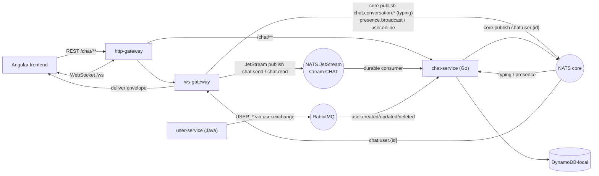

# Hermes Chat: End-to-End Real-Time Messaging

## Goal

Ship a robust vertical slice: a user opens (or starts) a conversation, sends a message,
it is persisted and delivered live to the other participant(s); history/pagination,
typing, read receipts, and presence (with durable "last seen") all work for **1:1 and
small group** chats. This is a **learning** build, so we deliberately use DynamoDB
(single-table), a RabbitMQ CQRS consumer, and NATS JetStream together.

## Decisions (locked)

- `chat-service` in **Go**, hexagonal layout mirroring the Java services (`core/ports` + `adapters`).
- **DynamoDB-local** (single-table design) for chat persistence.
- **RabbitMQ AMQP consumer** in Go to replicate `USER_*` events into a local user read-model (CQRS).
- **NATS JetStream** is the real-time hot path; reuse the wire contract from `gateways/ws-gateway/internal/protocol`.
- **Scope: 1:1 and small groups** now. 1:1 conversations use a **deterministic id** from
  sorted participant ids (get-or-create on first send); groups are created explicitly via REST.
- **JetStream end-to-end**: `ws-gateway` publishes the durable commands (`chat.send`, `chat.read`)
  via JetStream (with `clientMsgId` as the dedup `Nats-Msg-Id`); chat-service consumes them with a
  durable consumer (at-least-once + redelivery). Typing and per-user delivery stay on **core NATS**
  (ephemeral, fire-and-forget).
- **Trust model**: the gateway is the authentication boundary; chat-service trusts the
  `_headers.X-User-Id` identity it stamps, but **always authorizes the action by verifying the
  sender is a member of the conversation** in Dynamo before persisting / fanning out.
- **Idempotency**: send is deduped on `(convId, clientMsgId)` via a conditional put — retries are
  no-ops and re-`ack` the original `messageId`.
- **Presence**: ws-gateway broadcasts **live** presence (fast path, in-memory); chat-service
  **persists `lastActiveAt`** so the UI can show durable "last seen".
- **Testing**: unit tests on `core/services`, Dynamo-local integration tests on the adapters, and
  an automated e2e/smoke test in addition to the manual two-session check.

## Architecture

- Hot path (durable): `FE -> ws-gateway -> chat.send (JetStream) -> chat-service -> chat.user.{recipient} (core NATS) -> ws-gateway -> FE`.
- Live ephemeral path: typing + presence over core NATS (no persistence on the wire).
- Cold path (CQRS): `user-service -> user.exchange (RabbitMQ) -> chat-service user read-model`.

## Key existing facts the plan builds on

- ws-gateway already publishes `chat.send`, `chat.read`, `chat.conversation.{id}` and **expects**
  inbound `chat.user.{userId}` envelopes, but `SubscribeToUserMessages` is **never called**
  (`gateways/ws-gateway/internal/nats/client.go:85`). Nothing consumes `chat.send` today.
- ws-gateway currently publishes everything with **core NATS** (`conn.Publish`,
  `gateways/ws-gateway/internal/nats/client.go:257`). `chat.send`/`chat.read` must move to a
  **JetStream context** (`js.Publish`) with `nats.MsgId(clientMsgId)` for dedup (gw-jetstream step).
- `chat.send` is published as a **flat** payload: `senderId, senderEmail, conversationId, content,
  mediaId, clientMsgId` plus a `_headers` map (`X-User-Id`, `X-User-Email`, `X-Trace-Id`).
  `chat.read` is flat: `userId, conversationId, messageId, _headers`. Typing on
  `chat.conversation.{id}` is `{type:"typing", payload:TypingPayload, _headers}`.
- Inbound `chat.user.{id}` must be a `protocol.Envelope` (`{type, payload}`) — the gateway switches
  on `TypeMessage|TypeTyping|TypeReadReceipt|TypeAck` (`internal/nats/client.go:137`).
- NATS subjects/protocol live in `gateways/ws-gateway/internal/nats/client.go` and
  `gateways/ws-gateway/internal/protocol/messages.go`.
- Hub register/unregister loop is in `gateways/ws-gateway/internal/hub/hub.go:40` — the hook point
  for per-user subscribe/unsubscribe.
- user-service publishes to topic exchange `user.exchange` with routing keys
  `user.created|updated|deleted`; payload fields `aggregateId, email, name, occurredAt, eventType`
  (`services/user-service/.../infrastructure/config/RabbitConfig.java`).
- http-gateway routes are declarative in
  `gateways/http-gateway/src/main/resources/application.yml`; add a `chat-service` route mirroring
  the `user-service` block.
- Scaffold script supports Go: `scripts/new-service.sh chat-service 8085 --type go`
  (`scripts/new-service.sh`); it wires k8s overlays, devspace.yaml, `.github/services.json`,
  params.env. No DB flag (we use Dynamo, not Postgres).
- Infra dev deps are k8s deployments under `infrastructure/k8s/shared` (`nats`, `rabbitmq`, ...);
  no docker-compose. Mirror the `nats` base to add `dynamodb-local`. NATS must have **JetStream
  enabled** (`-js`) and a persistence volume.
- Frontend: cookie (HttpOnly) auth via `frontend/src/app/core/interceptors/auth.interceptor.ts`;
  messaging is **mock-only** in
  `frontend/src/app/domains/messaging/data/conversation.store.ts`; `openConversation()` only logs
  (`frontend/src/app/domains/messaging/features/home/home.ts`). No WS client exists.

## Conversation model & creation

- **Conversation id**
  - **1:1 (direct):** deterministic id `convId = dm_{minUserId}_{maxUserId}` (participant ids sorted
    so both sides resolve to the same conversation). Get-or-create on first `chat.send` or on the
    REST "open direct" call — no duplicate DMs.
  - **Group:** server-generated ULID, created explicitly via `POST /chat/conversations` with a
    member list + optional name; creator must be in the member list.
- **Membership is authoritative** in Dynamo and is the basis for send/read/typing authorization.

## DynamoDB single-table design (table `hermes-chat`)

- Conversation meta: `PK=CONV#{convId}`, `SK=META` — `type` (`direct|group`), `name`, `createdBy`,
  `members` (string set / list), `createdAt`, `lastMessageAt`, `preview`.
- Inbox / membership: `PK=USER#{userId}`, `SK=CONV#{convId}` — `lastMessageAt`, `unreadCount`,
  `lastReadMessageId`. (Query `PK=USER#{id}`, `SK begins_with CONV#` = a user's conversation list.)
- Messages: `PK=CONV#{convId}`, `SK=MSG#{ulid}` — `messageId`, `senderId`, `content`, `mediaId`,
  `createdAt`, `clientMsgId`. (Query `PK=CONV#{id}`, `SK begins_with MSG#`, `ScanIndexForward=false`
  + `LastEvaluatedKey` for keyset pagination.)
- Send dedup: `PK=CONV#{convId}`, `SK=DEDUP#{clientMsgId}` — `messageId`, written with
  `attribute_not_exists` conditional put in the same transaction/path as the message. On
  `ConditionalCheckFailed`, read the stored `messageId` and re-emit the original `ack` (idempotent).
- Read receipts: `PK=CONV#{convId}`, `SK=READ#{userId}` — `lastReadMessageId`, `readAt`.
- Presence (durable last-seen): `PK=USER#{userId}`, `SK=PRESENCE` — `status`, `lastActiveAt`.
  (Kept separate from the CQRS profile item so presence writes never clobber profile data.)
- User read-model (CQRS): `PK=USER#{userId}`, `SK=PROFILE` — `email`, `name`, `updatedAt`.
- Rabbit idempotency: conditional put on `PK=EVENT#{aggregateId}#{occurredAt}`, `SK=EVENT` so
  duplicate Rabbit deliveries are no-ops.

## chat-service flow (send_message)

1. Consume `chat.send` (JetStream durable consumer over stream `CHAT`, subjects `chat.send`,
   `chat.read`). `Ack` only after Dynamo persistence succeeds; redelivery on failure.
2. Resolve conversation: for `direct` get-or-create by deterministic id; **authorize** the sender is
   a member (`PK=USER#{sender}`, `SK=CONV#{convId}` / `members` on meta) — reject otherwise.
3. Dedup on `(convId, clientMsgId)`; if new, assign `messageId` (ULID), persist message, write the
   `DEDUP#` marker, bump `lastMessageAt`/`preview` + other members' `unreadCount`. If duplicate,
   skip persistence and reuse the stored `messageId`.
4. Publish `message` envelope to `chat.user.{participant}` (core NATS) for each member (incl. sender
   echo) and an `ack` envelope (`clientMsgId`->`messageId`) to `chat.user.{sender}`.
5. ws-gateway (now subscribed to `chat.user.{userId}`) delivers to the live client.

- `chat.read` -> authorize membership -> persist read state (`READ#{userId}`, reset `unreadCount`)
  -> publish `read_receipt` to other members.
- `chat.conversation.{id}` (typing, core NATS) -> authorize membership -> fan out `typing` to other
  members.
- presence/online events (core NATS) -> upsert `USER#{id}` `PRESENCE` `lastActiveAt`.

## Protocol reuse

Duplicate the small envelope + payload structs into `chat-service/internal/protocol` with identical
JSON tags (fast for now). Add a `CreateConversation` request/response shape for the new REST
endpoint and a `lastActiveAt` field where presence is surfaced. Note as a future refactor: extract a
shared Go module so gateway and chat-service share one source of truth.

## Frontend auth-over-WebSocket

Connect to `ws://localhost:8080/ws` (the http-gateway `/ws` route) so the request targets the same
origin (`:8080`) that owns the HttpOnly `access_token` cookie — the gateway already accepts the
`access_token` cookie (`gateways/ws-gateway/internal/handlers/websocket.go` `extractToken`).
Fallback option: fetch a short-lived token and use the `Sec-WebSocket-Protocol: bearer.<token>`
subprotocol.

## Security / trust boundary

- ws-gateway authenticates the WS via the `access_token` cookie and stamps `X-User-Id`/`X-User-Email`
  into `_headers`. chat-service **does not** see the JWT.
- chat-service treats the gateway as the identity authority (no JWT re-validation) but **authorizes
  every command against Dynamo membership** before any mutation or fan-out.
- REST endpoints read the `X-User-Id` stamped by the gateway; chat-service rejects requests without
  it (defense in depth — the route is only reachable through the gateway).

## Out of scope (future)

- Shared chat event JSON Schemas in `events/` (only needed when a media/notification service
  consumes chat events).
- Migrating Dynamo->Scylla or a JetStream<->RabbitMQ bridge.
- Multi-device (gateway currently evicts a user's prior connection).
- Zero-trust JWT re-validation inside chat-service (gateway remains the auth boundary for now).

## Next steps (checklist)

- [x] **infra-dynamo** — Add dynamodb-local to infra: create
  `infrastructure/k8s/shared/dynamodb/{base,overlays}` mirroring the nats base
  (image `amazon/dynamodb-local`, Service `dynamodb-local:8000`, PVC for `-sharedDb` persistence);
  register overlays in the cluster kustomizations.
- [x] **infra-jetstream** — Ensure the shared `nats` deployment runs with JetStream enabled (`-js`)
  and a persistence volume; bump the overlay if needed.
- [x] **scaffold** — Run `scripts/new-service.sh chat-service 8085 --type go` to generate k8s
  overlays, devspace.yaml image/dev blocks, `.github/services.json` entry, and params.env. Add
  `DYNAMODB_HOST/PORT`, `NATS_HOST/PORT`, `RABBITMQ_HOST/PORT`, `CHAT_PROFILE` to params.env.
- [ ] **chat-skeleton** — Create `services/chat-service` Go module + Dockerfile with hexagonal
  layout (`cmd/server`, `internal/config`, `internal/core/{domain,ports,services}`,
  `internal/adapters/{input,output}`, `internal/protocol`). Wire config loading + `/healthz` +
  graceful shutdown like ws-gateway.
- [ ] **dynamo-repo** — Implement DynamoDB single-table adapters (aws-sdk-go-v2):
  ensure-table-on-startup; MessageRepository (put + dedup conditional put + keyset query),
  ConversationRepository (meta + members + inbox + get-or-create direct), ReadReceiptRepository,
  PresenceRepository (`lastActiveAt`), UserRepository (read-model). Local endpoint with dummy creds.
- [ ] **gw-jetstream** — Change ws-gateway to publish `chat.send` and `chat.read` via a JetStream
  context (`js.Publish` with `nats.MsgId(clientMsgId)` on send for server-side dedup); declare/ensure
  the `CHAT` stream (subjects `chat.send`, `chat.read`). Keep typing/presence/`chat.user.*` on core.
- [ ] **nats-hotpath** — chat-service NATS adapters: durable JetStream consumer for
  `chat.send`/`chat.read` (manual ack after persist), core subs for `chat.conversation.*` (typing)
  and presence; ChatService orchestration (authorize membership, persist, dedup, fan-out); output
  publisher to `chat.user.{id}` reusing the protocol envelope/payload types.
- [ ] **amqp-cqrs** — RabbitMQ AMQP consumer (amqp091-go): declare/bind queues to `user.exchange`
  (`user.created/updated/deleted`), unmarshal the JSON body (ignore `__TypeId__` header),
  upsert/delete the user read-model in Dynamo with `EVENT#` idempotency.
- [ ] **presence-persist** — Consume presence/online events and persist `USER#{id}` `PRESENCE`
  (`status`, `lastActiveAt`); expose last-seen via the inbox/conversation REST responses.
- [ ] **chat-rest** — REST handlers on chat-service (port 8085), reading `X-User-Id`:
  `POST /chat/conversations` (create group / open-or-create direct),
  `GET /chat/conversations` (inbox, incl. members + last-seen),
  `GET /chat/conversations/{id}/messages?cursor=&limit=` (paginated history).
- [ ] **gw-subscribe** — Wire the missing inbound delivery in ws-gateway: add a per-user
  subscription registry + `UnsubscribeUserMessages(userID)` in `internal/nats/client.go`, and call
  `SubscribeToUserMessages` on register / unsubscribe on unregister in `internal/hub/hub.go`.
- [ ] **http-route** — Add a chat-service route (`Path=/chat/**`) to http-gateway `application.yml`
  mirroring the user-service block (rate limiter + circuit breaker), plus `CHAT_SERVICE_HOST/PORT`
  env vars in the http-gateway overlays.
- [ ] **fe-realtime** — Frontend realtime layer: add `wsUrl` to `environment(.prod).ts`; create a
  RealtimeService (native WebSocket to `ws://localhost:8080/ws`, reconnect w/ backoff, ping/pong,
  RxJS stream of envelopes, `send()`); add Envelope + payload types to `messaging.models.ts`.
- [ ] **fe-data** — Frontend data layer: MessageService (REST create-conversation + inbox + history
  pagination), MessageStore (signals, optimistic send with clientMsgId, reconcile on ack/message,
  unread/read state); replace ConversationStore mock with the real REST inbox.
- [ ] **fe-thread** — Frontend UI: add route `home/:conversationId` -> ChatThread component (message
  list w/ infinite scroll, composer that sends `send_message`, typing indicator, read receipts,
  presence + last-seen, group support). Make `openConversation()` navigate instead of console.log;
  add a "new chat / new group" entry point.
- [ ] **tests-unit** — Unit tests for `core/services` (authorization, dedup, fan-out, read state)
  with mocked ports.
- [ ] **tests-integration** — Dynamo-local integration tests for each repository (table bootstrap,
  keyset pagination, conditional dedup, get-or-create direct) and a JetStream consumer ack/redeliver
  test against a local NATS.
- [ ] **e2e** — Automated smoke test + manual verification: deploy via `make back-local` / devspace;
  with two sessions, send 1:1 and group messages and confirm live delivery, ack reconciliation,
  dedup on retry, persisted history on reload, typing + read receipts + presence/last-seen. Update
  docs/architecture.
